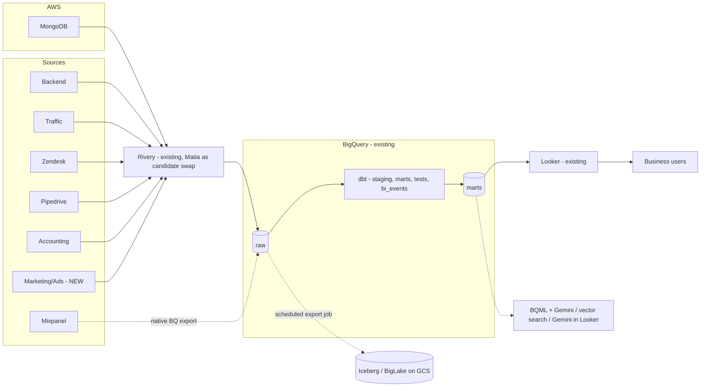
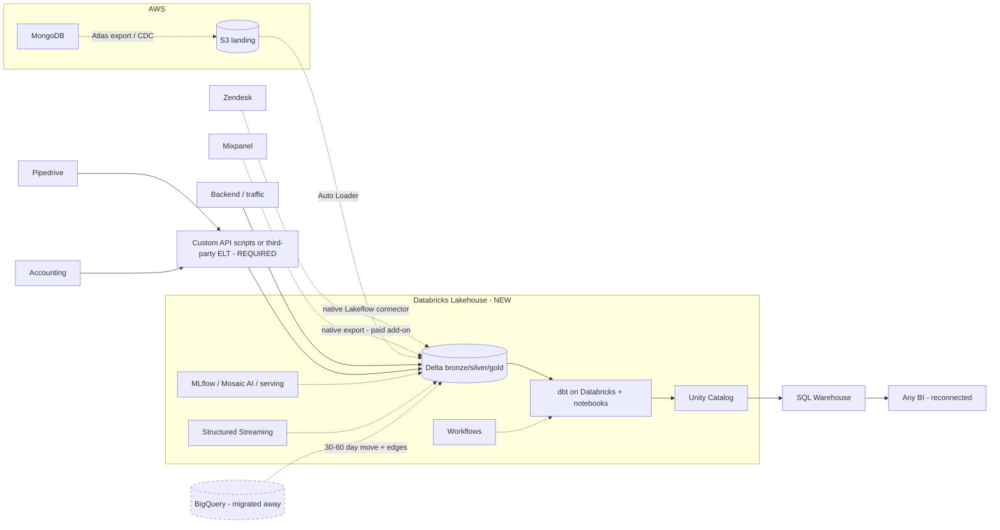

# Data Infrastructure Recommendation: Current Stack vs. End-to-End Databricks

**Prepared by Gil. Independent analysis and POC management plan.**

---

## Executive Summary

The current pipeline is live and functioning: **MongoDB (AWS) > Rivery > BigQuery > dbt Cloud > Looker**. The question: is it good enough for today and at scale, or does Databricks buy enough capability to justify a migration?

**Recommendation: stay. The gap is missing data, not a missing platform.** Mixpanel, Zendesk, Pipedrive, the accounting tools and the entire marketing/ads domain never reach the warehouse. Until they do, the company cannot measure CAC against booking revenue, campaign ROI, support cost per booking or funnel conversion. Closing that gap is connector and modeling work on the stack already running, not a platform decision.

Two things decide it:

1. **Ingestion coverage and maturity.** Databricks covers the gap only partially: Lakeflow Connect has a native Zendesk connector and Mixpanel ships a native export, but Pipedrive and the accounting tools still need custom API scripts or a third-party tool, and the native connector set is young against Rivery's 200+ production catalog already wired in.
2. **Reversibility.** All-in-one is an upside when the need is platform-native: streaming and ML serving are built in and fast to adopt. When the need lives outside the box, the external tool must fit the platform's conventions, and the workaround is harder than on a composable stack where every layer swaps independently. Wrong choices on the current stack stay cheap to fix; a platform migration does not.

Databricks' real case is product-grade ML (the full model lifecycle in one governed space) and native streaming. Neither is on today's roadmap. Both are defined as tripwires (section 7) rather than reasons to pay now.

Bottom line: stay, close the data gaps this quarter, land raw data in open-format Iceberg on GCS so a future Databricks move becomes cheaper rather than harder, and revisit on explicit tripwires. This analysis was built independently and reaches the same conclusion as the internal POC already conducted.

---

## 1. Explicit Assumptions

| # | Assumption | Basis / to verify |
|---|---|---|
| A1 | Current stack: MongoDB (AWS) > Rivery > BigQuery > dbt Cloud > Looker, all functioning | Stated. Verify dbt test coverage and Looker adoption depth |
| A2 | Core feeds (MongoDB, backend, traffic, payments/loyalty) land in BigQuery, up to hundreds of millions of rows | Landscape |
| A3 | Mixpanel, Zendesk, Pipedrive, accounting not connected. Marketing/ad data absent entirely | Landscape |
| A4 | MongoDB to BigQuery billable volume approx. **0.5 TB/month**. Rivery list pricing: 5,000 credits/mo (1 credit per 100MB standard replication) at $0.75 to $0.90 per credit gives **$45K to $54K/yr. Log-based CDC (2 credits per 100MB) would double credits** | Verify replication mode and contract rate on day 1. The single biggest cost variable (section 5) |
| A5 | Lean data function. Platform must be sustainable by a small team | Interview |
| A6 | No committed production ML/AI roadmap today | Interview |
| A7 | No hard real-time SLA on analytics today | Current reporting patterns |
| A8 | Multi-cloud estate: GCP for analytics, application and MongoDB on AWS. Cross-cloud transfer already exists today (Mongo to BQ) | To verify, incl. current egress spend |

---

## 2. Reading the Landscape

The landscape shows a working core path and a set of dead ends. Every high-value business question currently blocked at Arbitrip (client profitability, acquisition efficiency, funnel conversion, revenue reconciliation) traces to a source that is not connected, not to a limit of the warehouse or the transformation layer. That is why this comparison is judged on the current and future gaps, in this order: **ingestion first, then AI/LLM, streaming and governance**, at what cost and when.

---

## 3. Capability Comparison

| Capability | Current stack | Databricks end-to-end | Verdict |
|---|---|---|---|
| Ingestion | Rivery live, 200+ mature connectors, swappable (Matia as candidate replacement, evaluated in section 5) | Partial native coverage: Lakeflow Zendesk connector (verify GA status), Mixpanel native export (paid add-on). Pipedrive and accounting need custom scripts or a third-party tool. Connector set is young | **Current** (coverage and maturity today) |
| Transformation | dbt Cloud live: versioned, tested, semantic | dbt runs on Databricks too. Migration means re-pointing and re-validating every model | **Tie** |
| Orchestration | dbt Cloud scheduling covers the DAG. Note: Rivery completion should trigger dbt via webhook/API rather than time-based schedules, a small known integration | Workflows are excellent. The same dbt scheduling carries over | **Tie** |
| Streaming | Pub/Sub plus Dataflow built from scratch if needed | Structured Streaming native, best-in-class | **Databricks** |
| AI / ML / LLM | Internal AI already covered: Gemini in Looker, BQML calls Gemini from SQL, Vertex AI for custom models. Pieces exist, assembled per use case | Wins specifically on the full ML lifecycle in one governed space: features, training, MLflow tracking, registry, serving with SLAs, monitoring. Matters for product-facing AI, not internal analytics | **Databricks** (only for product-grade ML serving) |
| Observability / quality | dbt tests plus elementary | Lakehouse monitoring, DQX | **Tie** |
| Governance / permissions | BQ IAM, Dataplex, Looker layer. Adequate but split | Unity Catalog: unified lineage, permissions, audit | **Databricks** |
| BI | Looker native to BQ today | SQL warehouses connect to any BI tool | **Tie** (migration still re-points existing models) |
| CI/CD | git plus dbt Cloud CI | git, Repos, GitHub Actions | **Tie** |
| Developer experience | SQL-first, matches available talent | First-class, assumes Spark/notebook culture | **Current** (this team profile) |
| Maintenance | All layers managed, near-zero ops | Workspace, catalog and cost governance are owned overhead | **Current** |
| Scalability | Proven at current volumes, scales to PB | Scales further for exotic workloads | **Tie** |

**The pattern:** Databricks wins the future-capability rows, and precision matters about what that means: internal analytics AI is already available on the current stack; what Databricks uniquely adds is product-grade ML operations. The current stack wins the present-operations rows. The rest tie. The decision reduces to one question: **is a product-facing AI or streaming future close and certain enough to pay for now?** Today: no, with tripwires (section 7).

---

## 4. Advantages / Disadvantages and Fit

**Current stack, pros:** working today. Every layer independently replaceable. Costs understood. SQL/dbt talent abundant and affordable locally. Value delivery starts immediately. **Cons:** streaming and unified ML need assembly. Governance split across tools. Per-credit ingestion pricing needs watching at scale (section 5).

**Databricks, pros:** strongest integrated ML story. Native streaming. Unity Catalog. Fast time-to-market for platform-native needs. Notebooks allow arbitrary Python. **Cons:** partial ingestion coverage with a young connector set. Needs outside the platform become harder workarounds. Migration consumes engineering capacity before delivering new value. Platform ownership overhead on a lean team.

**Fit:** the data function is lean and SQL-centric. The current stack is sustainable by a small team indefinitely. Databricks shines with a dedicated platform team; adopting it earlier means enterprise-platform overhead at startup scale. Growth on the current stack is additive: streaming, ML and connectors bolt on without replacing anything.

---

## 5. Cost Analysis

Both tables show the *incremental* annual run-rate. The shared baseline (existing BigQuery compute and storage for current feeds, Looker licensing) continues in both options and is excluded from both, so the comparison is like-for-like.

**Option A: current stack, scaled to 0.5 TB/month:**

| Item | Assumption | Est. annual |
|---|---|---|
| Rivery ingestion | 0.5 TB/mo billable, standard replication, $0.75 to $0.90 per credit (A4) | **$45K to $54K** (verify mode day 1: CDC doubles credits. Matia competitive quote to be obtained) |
| dbt | **dbt Core = $0** up to dbt Cloud self-service approx. $100/seat, team of 4 approx. $400/mo | $0 to $5K |
| BigQuery compute, new workloads | $6.25/TB scanned on-demand (US), partition enforcement as control | +$4K to $10K |
| New connectors (Mixpanel, Zendesk, Pipedrive, accounting, marketing) | API/SaaS sources in Rivery price per execution, not data weight. Marginal | +$3K to $8K |
| Observability | dbt tests plus elementary (OSS) | ~$0 |
| **Total incremental** | | **approx. $52K to $77K/yr** |

**Option B: Databricks end-to-end:**

| Item | Assumption | Est. annual |
|---|---|---|
| SQL warehouse (serverless) | BI workloads. Serverless DBU rate includes the underlying compute | $15K to $30K |
| Pipeline jobs (classic compute) | DBUs $6K to $12K **plus** the separate cloud bill for the instances underneath, roughly equal (FinOps analyses report 50 to 200 percent cost underestimation when this second bill is ignored; applies to classic compute, not serverless) | $12K to $24K |
| Ingestion, native paths | Zendesk via Lakeflow (verify GA status), Mixpanel native export (paid Mixpanel add-on), MongoDB via Atlas export/CDC to S3 then Auto Loader (the export job itself has cost and must be built) | $15K to $30K |
| Pipedrive + accounting | No native path: custom API scripts (engineering time) or a small third-party ELT subscription | +$3K to $8K |
| One-time migration | 30 to 60 days for the data-platform move with parallel-run validation. The long tail is the edges: BI re-pointing, orchestration rebuild, up to approx. 3 months total | one-time, not in run-rate |
| **Total incremental** | | **approx. $45K to $92K/yr plus migration effort** |

**Cross-cloud note:** Mongo (AWS) to GCP transfer exists today and its egress belongs in Option A's verified baseline (open question 6). A Databricks-on-AWS variant, co-located with MongoDB and the application, would cut that egress but re-points BI cross-cloud and carries the same connector gaps, so it does not change the verdict; it becomes relevant only if the company consolidates on AWS (tripwire adjacent).

**Honest cost conclusion:** at 0.5 TB/month the run-rates are comparable, because Databricks' compute-based native ingestion removes per-GB credit fees for the heavy sources. Cost alone does not decide this. What decides it: a one-time migration with no new business value attached, the connector maturity gap (two sources uncovered, parts of the native set young), and reversibility (section 6).

**Cost levers on the current stack, in order:** (1) verify replication mode: if log-based CDC is configured where standard replication suffices, the ingestion bill halves. (2) Annual credit rates ($0.75 vs $0.90). (3) A Matia competitive quote. (4) Moving the heaviest sources off per-GB pricing entirely: MongoDB via Dataflow/Atlas export to GCS, Mixpanel via its native BigQuery export. Lever 4 alone can bring Option A's ingestion line well below either platform's list-price path.

---

## 6. Risk Assessment

| Risk | Current stack | Databricks |
|---|---|---|
| Vendor lock-in | Low, per layer: any component swaps independently. dbt code is portable SQL. BQ exit bounded (standard SQL, export, Iceberg) | Platform-level coupling (Workflows, Unity Catalog, notebooks). Mitigated by open formats: the data exits easily, the workflows do not |
| Integration complexity | Already integrated and running | Clean internally, expensive at the edges (BI re-pointing, cross-cloud movement, two sources still external) |
| Future flexibility | High. Composability plus the Iceberg hedge keeps every door open | Committed. Reversing is a second migration |
| Talent availability | SQL/dbt engineers abundant, affordable locally | Spark/platform engineers scarce, premium-priced |
| Migration between solutions | Current to Databricks later: moderate (dbt ports, Iceberg-ready raw cheapens the move) | Databricks back to a warehouse stack: painful. The asymmetry favors staying until tripwires fire |
| Cost runaway | Per-credit ingestion at scale. Monitored, with the per-source mitigations of section 5 | Dual billing on classic compute (DBUs plus cloud instances), the second bill commonly under-budgeted |

---

## 7. Recommendation and Tripwires

**Stay. Invest in the data gaps.**

**Tripwire 1 flips the decision on its own:** a committed product-AI/LLM roadmap with customer-facing serving SLAs. This is the one genuine Databricks-shaped need.

**Revisit when any two of the following fire:** (2) a real streaming requirement as product capability. (3) Data/platform team reaches 4+. (4) Ingestion cost sustains above approx. $150K/yr after the section 5 levers. Derivation of the threshold: roughly the point where per-credit ingestion alone exceeds Option B's entire incremental run-rate with the migration cost amortized over two years.

**The hedge:** a scheduled export job (BigQuery tables for Apache Iceberg / BigLake) writes the raw layer to GCS in open format, readable by BigQuery today and Databricks tomorrow. Scope is raw data only: marts, Looker models and orchestration would still need porting, so the hedge makes a future migration meaningfully cheaper, not free. Cost: storage cents plus one small job.

---

## 8. AI/LLM on the Current Stack

An LLM solution does not require Databricks. BigQuery embeds one natively:

- **BigQuery ML plus Gemini:** `ML.GENERATE_TEXT` calls Gemini directly from SQL over warehouse data (summarize tickets, classify bookings, extract entities). No infrastructure to run.
- **Native vector search:** `ML.GENERATE_EMBEDDING` plus `VECTOR_SEARCH` in BigQuery gives RAG over governed data without a separate vector database.
- **Gemini in Looker:** natural-language questions over the existing semantic layer.
- **Vertex AI** (Google's managed AI platform for model hosting, Gemini APIs and agents; not a vector database) covers custom model serving when needed. Pay-per-use, no standing cost until used.

**Internal AI ships on the current stack within a quarter. The precondition is trusted, tested marts, not a new platform.** Product-facing AI at serving-SLA scale is the honest Databricks case: tripwire 1.

---

## 9. Implementation Plan: First 100 Days

| Timeline | Scenario A: stay (recommended) |
|---|---|
| **Days 1 to 15** | Verify assumptions (Rivery billable volume and replication mode, dbt test coverage, Looker depth, current egress spend). Request Matia quote. Open API access requests for Zendesk, Pipedrive, Mixpanel, accounting, ad platforms (longest lead, start day 1). Baseline BQ spend, set budget alerts |
| **Days 15 to 45** | Connect Zendesk and Pipedrive through Rivery. Land raw, model in dbt with tests from day one. Wire Rivery completion to trigger dbt runs (webhook/API) |
| **Days 45 to 75** | Mixpanel via native BQ export (volume-safe). Accounting connector. First cross-source marts: support cost per corporate client, CAC vs. booking revenue. Numbers the company has never had |
| **Days 75 to 100** | Marketing data in. Unified event schema (bi_events, per Q1) deployed on first two services. Metric definitions locked in dbt/Looker. Quality alerts to Slack. Iceberg hedge job stood up |

**Scenario B: migrate.** Days 1 to 60: the data-platform move with parallel-run validation (dbt re-pointing, Delta landing, SQL warehouse for BI); the migration's long tail is the edges: BI re-pointing and orchestration rebuild, up to approx. 3 months total, consistent with section 5. Only then does the identical gap-closing sequence begin. Same destination, roughly one quarter later, with no new business value produced by the move itself.

**Resources:** 1 data engineer, 2 to 4 hours/week backend support, Looker admin access. **Opening risks:** source-API access delays (mitigate: requests on day 1). Replication-mode surprises (mitigate: it is the first task). BQ cost from new workloads (mitigate: partition enforcement and alerts from day one).

---

## 10. Architecture Maps

**Option A: current pipeline, gaps closed, plus hedge (recommended):**

**Option B: Databricks end-to-end (evaluated):**

---

## 11. Open Questions

1. Rivery actual billable volume, replication mode (standard vs CDC) and contract rate. The biggest cost variable.
2. Matia competitive quote: price, sync speed, BigQuery destination and connector coverage for our exact sources.
3. Committed product-AI/LLM roadmap with serving SLAs? (Tripwire 1: flips the recommendation on its own.)
4. Real freshness SLAs per domain. Is anything genuinely sub-minute?
5. Data team growth plan, next 18 months (tripwire 3).
6. Cloud topology detail (application, S3, Atlas) and current cross-cloud egress spend.
7. dbt tier and test coverage today. Looker adoption depth (LookML models vs dashboards only).
8. Marketing data: which ad platforms, who owns access, where does spend data live?
9. Compliance scope (PCI via payment tools, GDPR for EU travelers). Affects connector tiers and PII handling.
10. Lakeflow Zendesk connector status (preview vs GA) and Mixpanel Databricks-export add-on pricing, if Option B is ever revisited.

---

## Sources

- Rivery pricing (credits, per-source rates, plan tiers): rivery.io/pricing, rivery.io/blog/rivery-unlimited-pricing
- Matia platform (ingestion, observability, catalog): matia.io
- BigQuery pricing (on-demand $6.25/TB US, editions): cloud.google.com/bigquery/pricing
- Databricks pricing (DBU rates by compute type): databricks.com/product/pricing; FinOps context: cloudzero.com/blog/databricks-pricing
- Lakeflow Connect Zendesk connector: docs.databricks.com (ingestion/lakeflow-connect/zendesk-support)
- Mixpanel native Databricks export: docs.mixpanel.com (data-pipelines/integrations/databricks)
- BigQuery ML generative functions and vector search: cloud.google.com/bigquery/docs
